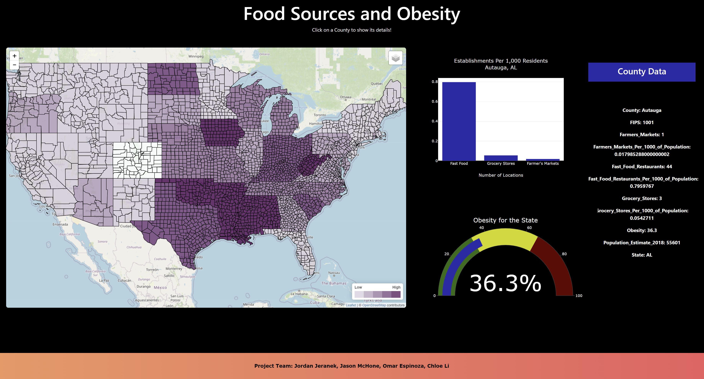

# Project 3: Food Sources Atlas
## Team 8 Members:
Jordan Jeranek, Chloe Li, Jason McHone, Omar Espinoza
## Background
Food environment, specifically food accessibility, has been shown to influence dietary patterns, which ultimately affects nutrition-related diseases such as diabetes, obesity, and cardiovascular disease (Ly et al., 2020).
## Project Goal
In this project, we created a map of food accessibility environment in the US, at a county level, including one health indicator (obesity). Statistics on food environment indicators were gathered and a spatial overview of US communities’ ability to access healthy food choices was developed.
## General Approach
A dashboard page with multiple charts that update from one data source
## Data Source and Data Set
Economic Research Service (ERS), U.S. Department of Agriculture (USDA). Food Environment Atlas. 
https://www.ers.usda.gov/data-products/food-environment-atlas/
Data set contains 3,143 records and 11 fields, including:
- FIPS
- State
- County
- Population
- Fast Food Restaurants
- Fast Food Restaurants Per 1000 of Population
- Grocery Stores
- Grocery Stores Per 1000 of Population
- Farmers Markets
- Farmers Markets Per 1000 of Population
- Obesity (%)
## Tools Used
- Python 
  - Flask
  - Pandas
- HTML/CSS
- Javascript
  - D3.js
  - Granim.js
  - jQuery
- Sqlite
- SqlAlchemy
- Leaflet
- Plotly
- Render to host Flask app
- GitHub to host webpage

## Data Cleanup
The following tasks were carried out to prepare the data.
- Import Data from USDA website
- Cleaning data using selected Variable Code including: FFR16, FFRPTH16, GROC16, GROCPTH16, FMRKT18, FMRKTPTH18, and PCT_OBESE_ADULTS17
- Give each selected Variable Code a proper name (Fast Food Restaurants, Fast Food Restaurants Per 1,000 of Population, Grocery Stores, Grocery Stores Per 1,000 of Population, Farmers Markets’, ’Farmers Markets Per 1000 of Population, Obesity (%) with the Matching Value.
- Make sure there is only one record for each county.
- Data placed into an Sqlite database, and then the Flask-powered API would move the data from the database into a JSON file to use for the web page.
- Result: combine all the variable codes to be one data set and apply them to the Map.

## Dashboard

## Findings
Obesity and other health indicators are complex issues that cannot be reduced to a few variables. We studied food accessibility and were able to observe some trends. However, correlations were not significant.
- Obesity prevalence grows with the number of fast food restaurants.
- Obesity inversely proportional to the number of grocery stores and farmers’ markets.
## Challenges Encountered
- Running a choropleth map with information from two datasets resulted in using jQuery to combine the datasets before entering into map creation.
- Initially attempted to house data in MongoDB, but struggled to get data back out via Flask. Changed to Sqlite instead.
- GitHub Pages loaded the page differently than Live Server. CSS was adjusted to fix the issue.
- Identifying an error in the data sets took longer than anticipated because of a lack of experience with the error being presented.
## Future Work
- Update dataset with county-level numbers of obesity (dataset used only has state averages).
- Change panel setup to output information in a nicer-looking way.
- Add hover feature to map to at least display the hovered county name. (Attempted, but unsuccessful).
- Add references to charts, for comparisons (e.g., state or national averages)